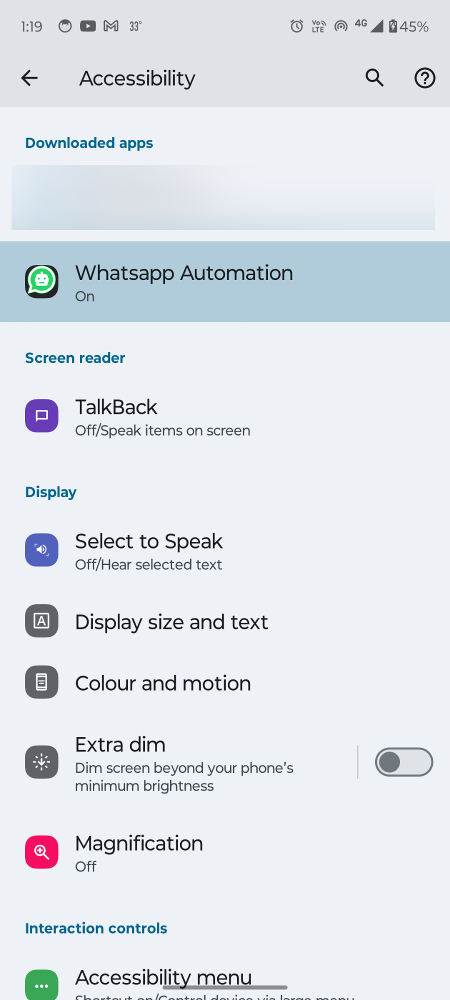
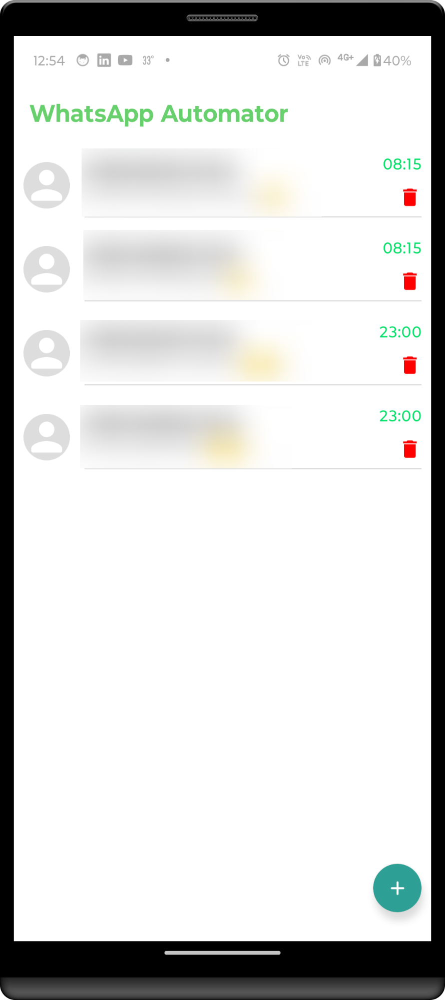
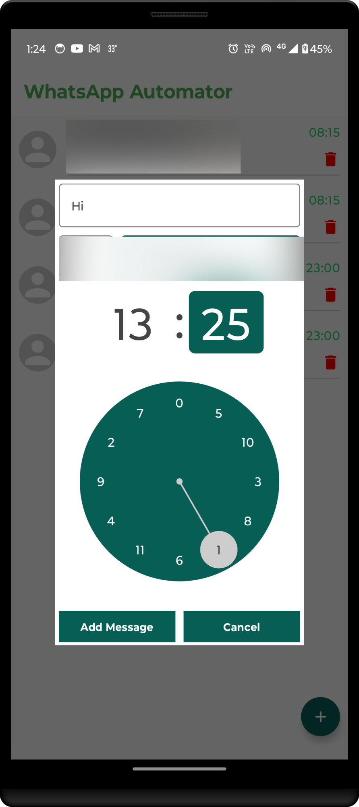
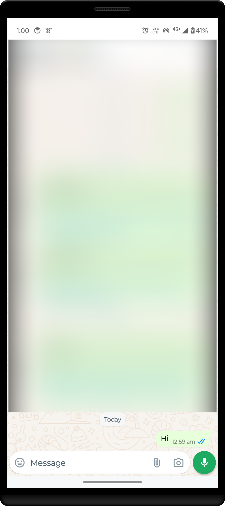

# WhatsApp Automator Android Application

An Android application that automates sending WhatsApp messages to a specific phone number at a set time every day, with the ability to stop the automation as needed.

## Table of Contents

- [Introduction](#introduction)
- [Features](#features)
- [Screenshots](#screenshots)
- [Installation](#installation)
- [Usage](#usage)
- [Permissions](#permissions)
- [Contributing](#contributing)
- [License](#license)
- [Contact](#contact)

## Introduction

The WhatsApp Automator is an Android application designed to automate the sending of WhatsApp messages to a specified phone number at a predetermined time every day. This can be particularly useful for sending daily reminders, updates, or any recurring messages.

To run it on your device, use this [link](https://github.com/Rahula-12/WhatsappAutomator/releases/download/WhatsappAutomator/WhatsAppAutomator.apk)

## Features

- Schedule WhatsApp messages to be sent at a specific time every day
- Option to stop the automated messages
- Simple and intuitive user interface

## Screenshots

<div>


  


</div>

## Installation

To run this project on your local machine, follow these steps:

1. **Clone the repository:**
    ```sh
    git clone https://github.com/Rahula-12/WhatsappAutomator.git
    ```

2. **Open the project in Android Studio:**
    - Launch Android Studio
    - Select `Open an existing project`
    - Navigate to the cloned repository's folder and select it

3. **Build the project:**
    - Let Android Studio download all necessary dependencies and build the project

4. **Run the project:**
    - Connect your Android device or start an emulator
    - Click the `Run` button in Android Studio

## Usage

1. **Launch the app** on your Android device.
2. **Switch on** the **Whatsapp Automation** Accessibility service in settings.
3. **Click on the FloatingAction Button** with Plus sign on Application screen.
4. **Set up a schedule**:
   - Enter the phone number you want to send messages to.
   - Enter the message text and don't forget to add at least 3 extra spaces at the end of the message(needed for working of Accessibility Service).
   - Set the time of day you want the message to be sent.
5. **Start the automation** by saving the schedule.
6. **Stop the automation**:
   - Click on the Red Dustbin icon on the rightmost end of schedule.

## Permissions

This application just requires the Whatsapp Automation Accessibility service to be switched on.

## Contributing

Contributions are welcome! To contribute to this project, follow these steps:

1. **Fork the repository**
2. **Create a new branch** for your feature or bugfix (`git checkout -b feature-branch`)
3. **Make your changes**
4. **Commit your changes** (`git commit -m 'Add new feature'`)
5. **Push to the branch** (`git push origin feature-branch`)
6. **Create a Pull Request**

## License

This project is licensed under the MIT License. See the [LICENSE](LICENSE) file for more information.

## Contact

If you have any questions, suggestions, or feedback, feel free to reach out:

- Email: ra9853044@gmail.com
- GitHub: [Rahula-12](https://github.com/Rahula-12)

---

Thank you for checking out the WhatsApp Automator Android application project!
